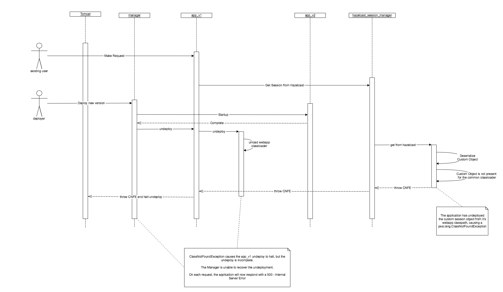

# java.lang.ClassNotFoundException, parallel deployments and the hazelcast-tomcat-sessionmanager

See: https://github.com/hazelcast/hazelcast-tomcat-sessionmanager/issues/

This repo reproduces the issue linked above using:
 
* an nginx docker container to simulate a load-balancer
* one basic tomcat instance upstream from the nginx instance, configured to use the hazelcast-tomcat-sessionmanager (with non-sticky sessions) and parallel deployments (only one instance is required).
* basic gatling tests to reproduce consistent load.

#### Description



#### Prerequisites
* Maven 3+
* Docker and docker-compose (i.e. https://docs.docker.com/docker-for-mac/install/)
* awk


#### Setup the Hazelcast Session Manager:

```
mkdir -p cluster/lib
curl http://central.maven.org/maven2/com/hazelcast/hazelcast-tomcat7-sessionmanager/1.1.3/hazelcast-tomcat7-sessionmanager-1.1.3.jar > cluster/lib/hazelcast-tomcat7-sessionmanager-1.1.3.jar
curl http://central.maven.org/maven2/com/hazelcast/hazelcast-all/3.9.1/hazelcast-all-3.9.1.jar > cluster/lib/hazelcast-all-3.9.1.jar
mvn clean package
```

#### Start the docker container 
```
docker-compose up
```

#### Run the gatling tests
In a different terminal window:
```
cd gatling-test
mvn gatling:execute
```

The location of the gatling reports will be printed to the terminal at the end of execution

#### Redeploy a new parallel version of the test application
In a different terminal window whilst the gatling tests are executing (from the project root - assuming no other tomcat containers are running):
```bash
docker container ls | grep tomcat:7.0-jre8 | cut -d ' ' -f 1 | awk '{print "docker exec "$1" cp /usr/local/tomcat/webapps/basic-web-app\#\#1.war /usr/local/tomcat/webapps/basic-web-app\#\#2.war" }' | xargs -I {} bash -c "{}"
```

#### Results
The Internal Server Error results can be viewed in the gatling report and demonstrated in the docker-compose output logs.
 
```bash
tomcatOne_1  | Sep 24, 2018 5:29:33 AM org.apache.coyote.http11.AbstractHttp11Processor process
tomcatOne_1  | SEVERE: Error processing request
tomcatOne_1  | com.hazelcast.nio.serialization.HazelcastSerializationException: java.lang.ClassNotFoundException: com.github.edwardsmatt.SessionData
tomcatOne_1  | 	at com.hazelcast.internal.serialization.impl.JavaDefaultSerializers$JavaSerializer.read(JavaDefaultSerializers.java:224)
tomcatOne_1  | 	at com.hazelcast.internal.serialization.impl.StreamSerializerAdapter.read(StreamSerializerAdapter.java:48)
tomcatOne_1  | 	at com.hazelcast.internal.serialization.impl.AbstractSerializationService.readObject(AbstractSerializationService.java:267)
tomcatOne_1  | 	at com.hazelcast.internal.serialization.impl.ByteArrayObjectDataInput.readObject(ByteArrayObjectDataInput.java:570)
tomcatOne_1  | 	at com.hazelcast.session.HazelcastSession.deserializeMap(HazelcastSession.java:141)
tomcatOne_1  | 	at com.hazelcast.session.HazelcastSession.readData(HazelcastSession.java:127)
tomcatOne_1  | 	at com.hazelcast.internal.serialization.impl.DataSerializableSerializer.readInternal(DataSerializableSerializer.java:158)
tomcatOne_1  | 	at com.hazelcast.internal.serialization.impl.DataSerializableSerializer.read(DataSerializableSerializer.java:105)
tomcatOne_1  | 	at com.hazelcast.internal.serialization.impl.DataSerializableSerializer.read(DataSerializableSerializer.java:50)
tomcatOne_1  | 	at com.hazelcast.internal.serialization.impl.StreamSerializerAdapter.read(StreamSerializerAdapter.java:48)
tomcatOne_1  | 	at com.hazelcast.internal.serialization.impl.AbstractSerializationService.toObject(AbstractSerializationService.java:185)
tomcatOne_1  | 	at com.hazelcast.map.impl.proxy.MapProxySupport.toObject(MapProxySupport.java:1149)
tomcatOne_1  | 	at com.hazelcast.map.impl.proxy.MapProxyImpl.get(MapProxyImpl.java:122)
tomcatOne_1  | 	at com.hazelcast.session.HazelcastSessionManager.findSession(HazelcastSessionManager.java:237)
tomcatOne_1  | 	at org.apache.catalina.connector.CoyoteAdapter.postParseRequest(CoyoteAdapter.java:822)
tomcatOne_1  | 	at org.apache.catalina.connector.CoyoteAdapter.service(CoyoteAdapter.java:440)
tomcatOne_1  | 	at org.apache.coyote.http11.AbstractHttp11Processor.process(AbstractHttp11Processor.java:1137)
tomcatOne_1  | 	at org.apache.coyote.AbstractProtocol$AbstractConnectionHandler.process(AbstractProtocol.java:637)
tomcatOne_1  | 	at org.apache.tomcat.util.net.AprEndpoint$SocketWithOptionsProcessor.run(AprEndpoint.java:2492)
tomcatOne_1  | 	at java.util.concurrent.ThreadPoolExecutor.runWorker(ThreadPoolExecutor.java:1149)
tomcatOne_1  | 	at java.util.concurrent.ThreadPoolExecutor$Worker.run(ThreadPoolExecutor.java:624)
tomcatOne_1  | 	at org.apache.tomcat.util.threads.TaskThread$WrappingRunnable.run(TaskThread.java:61)
tomcatOne_1  | 	at java.lang.Thread.run(Thread.java:748)
tomcatOne_1  | Caused by: java.lang.ClassNotFoundException: com.github.edwardsmatt.SessionData
tomcatOne_1  | 	at java.net.URLClassLoader.findClass(URLClassLoader.java:381)
tomcatOne_1  | 	at java.lang.ClassLoader.loadClass(ClassLoader.java:424)
tomcatOne_1  | 	at java.lang.ClassLoader.loadClass(ClassLoader.java:357)
tomcatOne_1  | 	at com.hazelcast.nio.ClassLoaderUtil.tryLoadClass(ClassLoaderUtil.java:173)
tomcatOne_1  | 	at com.hazelcast.nio.ClassLoaderUtil.loadClass(ClassLoaderUtil.java:147)
tomcatOne_1  | 	at com.hazelcast.nio.IOUtil$ClassLoaderAwareObjectInputStream.resolveClass(IOUtil.java:591)
tomcatOne_1  | 	at java.io.ObjectInputStream.readNonProxyDesc(ObjectInputStream.java:1868)
tomcatOne_1  | 	at java.io.ObjectInputStream.readClassDesc(ObjectInputStream.java:1751)
tomcatOne_1  | 	at java.io.ObjectInputStream.readOrdinaryObject(ObjectInputStream.java:2042)
tomcatOne_1  | 	at java.io.ObjectInputStream.readObject0(ObjectInputStream.java:1573)
tomcatOne_1  | 	at java.io.ObjectInputStream.readObject(ObjectInputStream.java:431)
tomcatOne_1  | 	at com.hazelcast.internal.serialization.impl.JavaDefaultSerializers$JavaSerializer.read(JavaDefaultSerializers.java:219)
tomcatOne_1  | 	... 22 more
```

